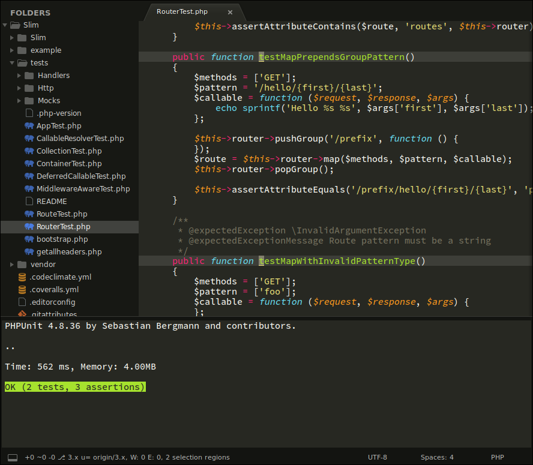

# sublime-test

 

A wrapper for running tests on different granularities.

Currently the following testing plugins are supported:

Language | Framework | Plugin
-------- | --------- | ------
PHP | PHPUnit | [PHPUnitKit](https://github.com/gerardroche/sublime-phpunit)
Python | Sublime Text | [UnitTesting](https://github.com/randy3k/UnitTesting)

## INSTALLATION

### Manual installation

1. Close Sublime Text.
2. Download or clone this repository to a directory named **`test`** in the Sublime Text Packages directory for your platform:
    * Linux: `git clone https://github.com/gerardroche/sublime-test.git ~/.config/sublime-text-3/Packages/test`
    * OS X: `git clone https://github.com/gerardroche/sublime-test.git ~/Library/Application\ Support/Sublime\ Text\ 3/Packages/test`
    * Windows: `git clone https://github.com/gerardroche/sublime-test.git %APPDATA%\Sublime/ Text/ 3/Packages/test`
3. Done!

## USAGE

Command | Description
--------|------------
`:TestSuite` | Run test suite of the current file.
`:TestFile` | Run tests for the current file. If the current file is not a test file, it runs tests of the test file for the current file.
`:TestNearest` | Run a test nearest to the cursor (supports multiple selections). If the current file is not a test file, it runs tests of the test file for the current file.
`:TestLast` | Run the last test.
`:TestSwitch` | Splits the window and puts nearest test case and class under test side by side.

## CREDITS

Inspired by [vim-test](https://github.com/janko-m/vim-test).

## LICENSE

Released under the [BSD 3-Clause License](LICENSE).
