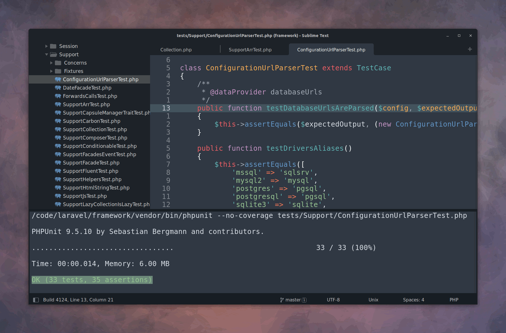

# sublime-test

[](https://sublimetext.com) [](https://github.com/gerardroche/sublime-test/tags) [](https://github.com/gerardroche/sublime-test/stargazers) [](https://twitter.com/gerardroche)

A wrapper for running tests on different granularities.



Currently the following testing plugins are supported:

Language | Framework | Package
-------- | --------- | -------
PHP | PHPUnit | [PHPUnitKit](https://github.com/gerardroche/sublime-test)
Mixed | Sublime Text | [ColorSchemeUnit](https://github.com/gerardroche/sublime_color_scheme_unit)
Python | Sublime Text | [UnitTesting](https://github.com/randy3k/UnitTesting)

To add support for your testing tool please open an issue and I'll do my best to help.

## INSTALLATION

### Manual installation

1. Close Sublime Text.
2. Download or clone this repository to a directory named **`test`** in the Sublime Text Packages directory for your platform:
    * Linux: `git clone https://github.com/gerardroche/sublime-test.git ~/.config/sublime-text-3/Packages/test`
    * OS X: `git clone https://github.com/gerardroche/sublime-test.git ~/Library/Application\ Support/Sublime\ Text\ 3/Packages/test`
    * Windows: `git clone https://github.com/gerardroche/sublime-test.git %APPDATA%\Sublime/ Text/ 3/Packages/test`
3. Done!

## USAGE

Command Palette | Command | Description
--------------- | ------- | -----------
`:TestSuite` | `test_suite` | Run test suite of the current file.
`:TestFile` | `test_file` | Run tests for the current file. If the current file is not a test file, it runs tests of the test file for the current file.
`:TestNearest` | `test_nearest` | Run a test nearest to the cursor (supports multiple selections). If the current file is not a test file, it runs tests of the test file for the current file.
`:TestLast` | `test_last` | Run the last test.
`:TestVisit` | `test_visit` | Open the last run test in the current window (useful when you're trying to make a test pass, and you dive deep into application code and close your test buffer to make more space, and once you've made it pass you want to go back to the test file to write more tests).
`:TestSwitch` | `test_switch` | Splits the window and puts nearest test case and class under test side by side.
`:TestResults` | `test_results` | Show the test results panel.
`:TestCancel` | `test_cancel` | Cancels current test run.

Add your preferred key bindings:

`Menu > Preferences > Key Bindings`

```json
[
    { "keys": ["super+a"], "command": "test_suite" },
    { "keys": ["super+f"], "command": "test_file" },
    { "keys": ["super+n"], "command": "test_nearest" },
    { "keys": ["super+l"], "command": "test_last" },
    { "keys": ["super+v"], "command": "test_visit" },
    { "keys": ["super+s"], "command": "test_switch" },
    { "keys": ["super+c"], "command": "test_cancel" },
    { "keys": ["super+r"], "command": "test_results" },
]
```

Key bindings that often provided by packages by default:

Key | Description
--- | -----------
`F4` | Jump to Next Failure
`Shift+F4` | Jump to Previous Failure

## CREDITS

Inspired by [vim-test](https://github.com/janko-m/vim-test).

## LICENSE

Released under the [BSD 3-Clause License](LICENSE).
